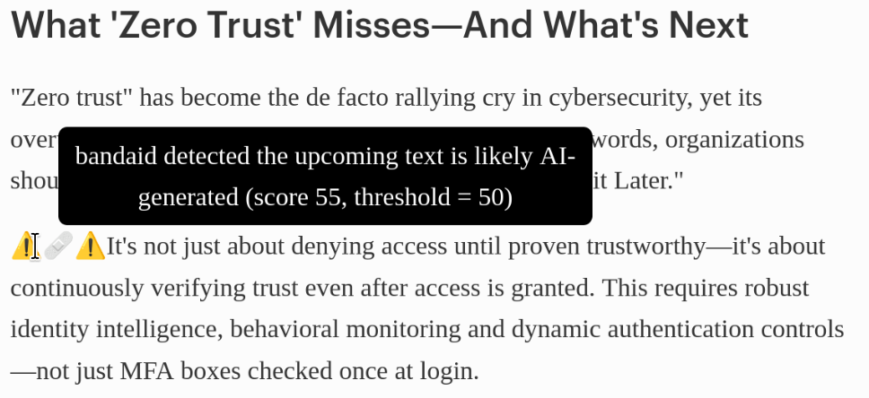

# bandaid

bandaid is a Firefox extension to detect the sloppiest of AI text slop.

bandaid can evaluate text from about any website you browse, and automatically
adds a `⚠️🩹⚠️` marker before the suspicious content

(a tooltip is available to explain what's going on):
`bandaid detected the upcoming text is likely AI-generated (score 55, threshold = 50)`

Since it calls for bad acronym, let's go for
"Basic, Automatic, Naturally-Designed AI Detector".

## Goals

- detect basic AI slop text: using simple rules, filter out the lowest-effort
  AI slop
- passive detection: automatically scan most of the text presented to the user
- understandable: both the code (human-generated!) and the user interface should
  be clear and minimal
